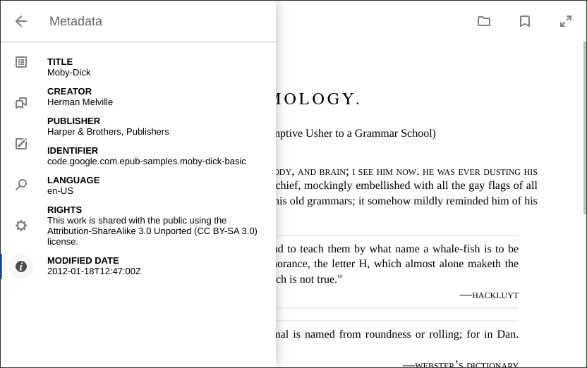

About this fork
================================
This fork is *only* used to re-package and integrate epubjs-reader with COPS

Please see https://github.com/intity/epubjs-reader for the original fork - with thanks to @intity and the alpha/beta testers :-)

Epub.js Reader
================================



About this Fork
-------------------------

This fork is meant for a web-based epub reader, where the initial `bookPath` is set via template variable in [dist/template.html](dist/template.html), e.g. with PHP Twig or Python Jinja2, and the epub content is served from the original .epub file via a PHP or Python script like [src/zipfs.php](src/zipfs.php), e.g. with bookPath = http://localhost:8000/zipfs.php/{bookId}/

The [dist/ files](dist/) are available as:
* PHP composer package: [mikespub/epubjs-reader](https://packagist.org/packages/mikespub/epubjs-reader), or
* NPM javascript package: [@mikespub/epubjs-reader](https://www.npmjs.com/package/@mikespub/epubjs-reader).

About the Reader
-------------------------

[Epub.js](https://github.com/futurepress/epub.js) library.


Getting Started
-------------------------

Open up [epubjs-reader](https://intity.github.io/epubjs-reader/) in a browser.

You can change the ePub it opens by passing a link to bookPath in the url:

`?bookPath=https://s3.amazonaws.com/epubjs/books/alice.epub`

Running Locally
-------------------------

Install [node.js](https://nodejs.org/en/)

Then install the project dependences with npm

```javascript
npm install
```

You can run the reader locally with the command

```javascript
npm run serve
```

Builds are concatenated and minified using [webpack](https://github.com/webpack/webpack)

To generate a new build run

```javascript
npm run build
```
